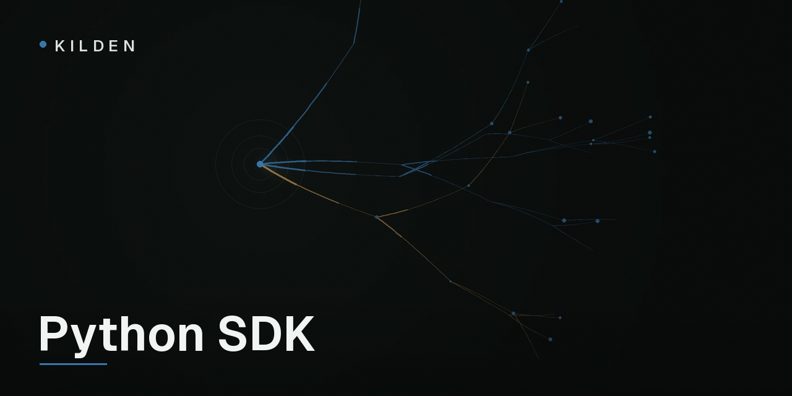

<p align="center">
  
</p>

# kilden

[](https://pypi.org/project/kilden/)
[](https://github.com/freshworkstudio/kilden-sdk-python/actions/workflows/ci.yml)
[](LICENSE)

The Python server-side SDK for [Kilden](https://kilden.io), a customer data
platform: analytics, campaigns and session replay on one event pipeline.
Zero runtime dependencies, fully typed, fork-safe. Python 3.9+.

```sh
pip install kilden
```

```python
from kilden import Client

kilden = Client("sk_your_secret_key")  # the SECRET key — see below
kilden.track("user_42", "order_completed", {"revenue": 99.9, "currency": "CLP"})
kilden.close()  # on shutdown; see "Batching and shutdown"
```

Events are queued in memory and delivered in batches by a background
thread — `track()` costs nanoseconds and never blocks a request.

> **Use the secret write key, never the public one.** Events signed with the
> secret key arrive as `source=server`, `verified=true` — facts your funnels
> and revenue reports can trust. The constructor rejects public (`wk_…`)
> keys. Keep the secret key out of browsers, mobile apps and frontend
> bundles; the public key belongs to
> [kilden-sdk-js](https://github.com/freshworkstudio/kilden-sdk-js).

## Identity verification

Anyone can open a browser console and send events as `ceo@yourcorp.com`.
Kilden's answer is signed identity tokens: your backend — the only thing
that knows who is logged in — signs a short-lived token the browser SDK
attaches to its events. Without it, identified browser events stay
`verified=false` and sensitive consumers ignore them.

This SDK makes the signature three lines:

```python
from kilden import IdentitySigner

signer = IdentitySigner(os.environ["KILDEN_IDENTITY_SECRET"], kid="k1")

@app.route("/kilden/identity", methods=["POST"])
@login_required
def kilden_identity():
    token = signer.sign(current_user.id, traits={"plan": current_user.plan})
    return {"distinct_id": current_user.id, "token": token}
```

**Only ever sign an id your backend authenticated.** Signing something like
`request.json["user_id"]` lets anyone impersonate anyone — with a
"verified" stamp on top. `sign()` refuses TTLs over 7 days (default 1h);
`traits` become *signed traits* that override unsigned ones during
enrichment. The `IdentitySigner` is a separate class precisely so a
page-rendering controller can sign tokens without touching the event queue.

## Feature flags

```python
if kilden.is_enabled("new_checkout", "user_42",
                     person_properties={"plan": "pro"},
                     default=False):
    ...

variant = kilden.get_feature_flag("experiment_button", "user_42")
# False | True | "variant_key"
```

Flags are evaluated remotely against `/decide` with a 30-second in-memory
cache per `distinct_id`. `person_properties` overrides stored person traits
for that evaluation only (and bypasses the cache). If Kilden cannot answer
within the client timeout you get `default` back — flag checks never raise
and never block beyond one request.

## Batching and shutdown

`track()`, `identify()` and `alias()` enqueue; a daemon thread flushes every
10 seconds or 20 events (configurable). Two consequences you should know:

- **Call `close()` when your process exits.** It flushes with a 10-second
  deadline and stops the worker. Without it you rely on the `atexit` hook,
  which does not run when the process is SIGKILLed — events queued in the
  last seconds would be lost.
- The queue is bounded (`max_queue_size`, default 10 000). When full, new
  events are dropped and counted in `client.dropped_count` — the SDK never
  blocks your request thread and never grows without bound.

Delivery retries 429/5xx/network errors three times with exponential
backoff and jitter, honoring `Retry-After`. Other 4xx responses are dropped
immediately — retrying a bad request is spam.

## Fork safety (gunicorn, celery, uwsgi)

Preforking servers import your app once and then fork. Without care, each
worker inherits the parent's event queue (double-sends) and a dead worker
thread (nothing sends at all). This SDK checks the process id on every
enqueue: in a forked child it discards the inherited queue — those events
belong to the parent — and starts a fresh worker thread. This is tested in
CI against a real preforked gunicorn, not simulated. You do not need
post-fork hooks; it just works.

## Configuration

```python
Client(
    "sk_…",
    host="https://ingest.kilden.io",
    flush_at=20,          # events that trigger a flush
    flush_interval=10,    # seconds between flushes
    max_queue_size=10000,
    timeout=3,            # per HTTP request, seconds
    transport=None,       # bring your own; must expose send(url, body, headers)
    debug=False,
    enabled=True,         # False = full no-op for tests/CI
)
```

`track`/`identify` accept `timestamp=` (ISO 8601 or `datetime`; for
backfills) and `uuid=` (idempotency across your own retries). Invalid input
after construction is dropped and logged, never raised — telemetry must not
take down a request. The constructor is the one place that fails fast.

## Spec

This SDK implements the
[Kilden Server SDK Specification](https://github.com/freshworkstudio/kilden-sdk-spec)
(spec 0.1) and runs its frozen test vectors in CI, byte-for-byte for
identity tokens. Behavior changes land in the spec first; divergence from
it is a bug worth [reporting](https://github.com/freshworkstudio/kilden-sdk-python/issues).

## Community

Questions and design conversations:
[Discussions](https://github.com/freshworkstudio/kilden-sdk-python/discussions).
Product docs: [docs.kilden.io](https://docs.kilden.io).

## License

[MIT](LICENSE)
